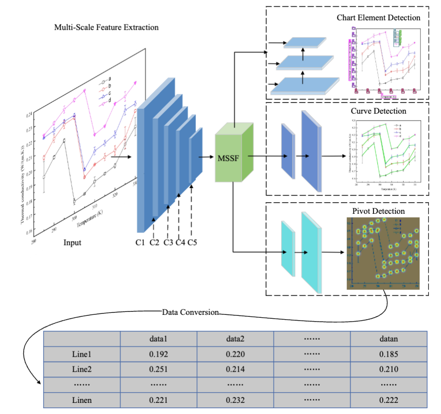
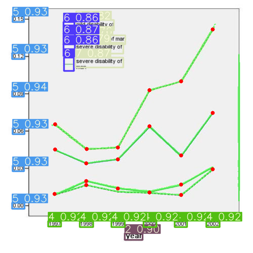

<div align="left">   

## Efficient extraction of experimental data from line charts using advanced machine learning techniques


---

### The Illustration of ChartParsing




### weight
- [x] [ChartParsing](https://drive.google.com/file/d/1P8i5cR8pr9ncKjaIzksrnViRZje6zf6C/view?usp=sharing)

### Visualization

#### ChartParsering Result



### Project Structure

```python
├─lib
│ ├─config/default   # configuration of training and validation
│ ├─core    
│ │ ├─activations.py   # activation function
│ │ ├─evaluate.py   # calculation of metric
│ │ ├─function.py   # training and validation of model
│ │ ├─general.py   #calculation of metric、nms、conversion of data-format、visualization
│ │ ├─loss.py   # loss function
│ │ ├─postprocess.py   # postprocess(refine da-seg and ll-seg, unrelated to paper)
│ ├─dataset
│ │ ├─Chart2019Dataset.py   # Superclass dataset，general function
│ │ ├─chart2019.py   # Subclass dataset，specific function
│ ├─models
│ │ ├─Chartparser.py    # Setup and Configuration of model
│ │ ├─DANet.py    # Attention module
│ │ ├─commom.py   # calculation module
│ ├─utils
│ │ ├─augmentations.py    # data augumentation
│ │ ├─autoanchor.py   # auto anchor(k-means)
│ │ ├─split_dataset.py  # (Campus scene, unrelated to paper)
│ │ ├─utils.py  # logging、device_select、time_measure、optimizer_select、model_save&
├─tools
│ │ ├─demo.py    # demo(folder、camera) 
├─weights    # Pretraining model
```

---

### Requirement

This codebase has been developed with python version 3.7, PyTorch 1.7+ and torchvision 0.8+:

```
conda install pytorch==1.7.0 torchvision==0.8.0 cudatoolkit=10.2 -c pytorch
```

See `requirements.txt` for additional dependencies and version requirements.

```setup
pip install -r requirements.txt
```

### Data preparation

#### Download

- Download the images from [images](https://drive.google.com/file/d/1bnuHyExM6JagB1caRfLVr20vef4nesi9/view?usp=sharing).

We recommend the dataset directory structure to be the following:

```
# The id represent the correspondence relation
├─dataset root
│ ├─images
│ │ ├─train
│ │ ├─val
│ ├─det_annotations
│ │ ├─train
│ │ ├─val
│ ├─point_annotations
│ │ ├─train
│ │ ├─val
│ ├─line_seg_annotations
│ │ ├─train
│ │ ├─val
```

Update the your dataset path in the `./lib/config/default.py`.

### Training

You can set the training configuration in the `./lib/config/default.py`. (Including:  the loading of preliminary model,  loss,  data augmentation, optimizer, warm-up and cosine annealing, auto-anchor, training epochs, batch_size).

If you want try alternating optimization or train model for single task, please modify the corresponding configuration in `./lib/config/default.py` to `True`. (As following, all configurations is `False`, which means training multiple tasks end to end).

```python
# Alternating optimization
_C.TRAIN.DET_ONLY = False           # Only train detection branch
_C.TRAIN.ENC_DET_ONLY = False       # Only train encoder and detection branch
_C.TRAIN.ENC_KP_ONLY = False                  # Only train kp detection
_C.TRAIN.KP_DET = True  
_C.TRAIN.KP = False  

# Single task 
_C.TRAIN.KP_ONLY = False      # Only train keypoint task
_C.TRAIN.LINE_ONLY = False          # Only train line_segmentation task
_C.TRAIN.DET_ONLY = False          # Only train detection task
```

Start training:

```shell
python tools/train.py
```


### Evaluation

You can se_t the evaluation configuration in the `./lib/config/default.py`. (Including： batch_size and threshold value for nms).


#### Folder

You can store the image or video in `--source`, and then save the reasoning result to `--save-dir`

```shell
python tools/demo.py --source inference/images
```


#### Demonstration

<table>
    <tr>
            <th>input</th>
            <th>output</th>
    </tr>
    <tr>
        <td></td>
        <td></td>
    </tr>
    <tr>
         <td></td>
        <td></td>
    </tr>
</table>

**Notes**: 

- The works we has use for reference including `YOLOP`  [code](https://github.com/hustvl/YOLOP)）works.

## Citation

If you find our paper and code useful for your research, please consider giving a star :star:   and citation :pencil: :


```bibtex
@inproceedings{yang2025ai,
  title={AI-ChartParser: A Method For Extracting Experimental Data From Curve Charts in Academic Papers},
  author={Yang, Wenjin and He, Jie and Zhang, Xiaotong and Gong, Haiyan},
  booktitle={Computer Graphics Forum},
  pages={e70146},
  year={2025},
  organization={Wiley Online Library}
}

